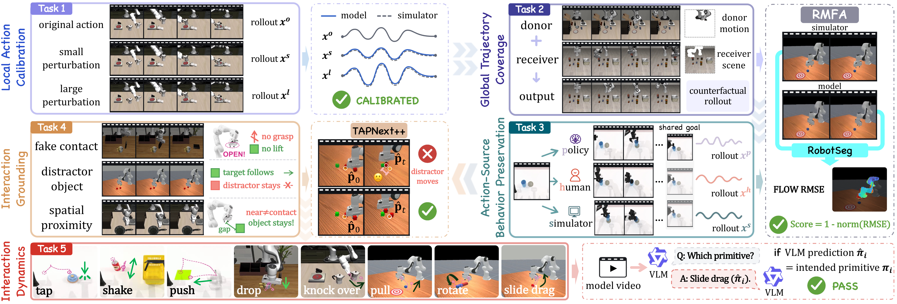

<h1 align="center">WorldSimProbe</h1>

<h3 align="center">
Diagnosing Simulator Faithfulness in Action-Conditioned World Models for Embodied Manipulation
</h3>

<p align="center"><em>A rollout can look right for the wrong reason.</em></p>

<p align="center">
  <a href="https://evophys.com/WorldSimProbe/"></a>
  &nbsp;
  <a href="https://evophys.com/WorldSimProbe/"></a>
  &nbsp;
  <a href="https://huggingface.co/datasets/petersonco/worldsimprobe"></a>
  &nbsp;
  <a href="https://huggingface.co/datasets/petersonco/worldsimprobe_validation"></a>
  &nbsp;
  <a href="LICENSE"></a>
</p>

## 🔥 Overview

Action-conditioned world models can generate visually plausible rollouts while
ignoring the supplied action trajectory, reverting to task-typical behavior,
moving the wrong object, or hallucinating unsupported physical interactions.

**WorldSimProbe** evaluates the causal chain from an action intervention to the
robot motion and environment response realized in the generated video. Its five
diagnostic tasks cover local action calibration, global trajectory coverage,
action-source behavior preservation, interaction grounding, and interaction
dynamics across **RoboTwin**, **ManiSkill**, and **LIBERO**.

<p align="center">
  <a href="https://evophys.com/WorldSimProbe/#diagnostic-suites">
    
  </a>
</p>

<p align="center">
  <em>Five probes reveal where the action-to-rollout causal chain fails.</em>
</p>

Explore interactive probes, aligned rollouts, and failure cases on the
[project page](https://evophys.com/WorldSimProbe/).

## 🗞️ News

- **`2026-08-20`**: 🤗 Released the **WorldSimProbe validation set**, including reference videos for internal evaluator testing, on [Hugging Face](https://huggingface.co/datasets/petersonco/worldsimprobe_validation).
- **`2026-08-10`**: 🤗 Released the public **RoboTwin**,**Maniskill** and **LIBERO** test sets on [Hugging Face](https://huggingface.co/datasets/petersonco/worldsimprobe).
- **`2026-08-06`**: 🔥 Released the complete **Task 1-5 evaluation code** and submission toolkit.

## 🎯 TODO

- [x] Release the Task 1-5 evaluation code and submission toolkit.
- [x] Release the public RoboTwin and LIBERO test sets.
- [x] Release the validation set with reference videos for internal evaluator testing.
- [ ] Launch the public leaderboard *(ETA: 1 week)*.
- [ ] Release the generation pipeline *(ETA: 1-2 months)*.

## 💬 Community

Join the **WorldSimProbe WeChat group** for benchmark updates, submission
questions, and community discussion.

For benchmark, submission, or evaluation questions, email
[worldsimprobe@outlook.com](mailto:worldsimprobe@outlook.com).

<p align="center">
  
</p>

<p align="center"><sub>WeChat invitation QR codes are time-limited; this image will be refreshed when a new code is issued.</sub></p>

## 🎯 Five Diagnostic Tasks

| Task | Diagnostic question | Evaluation |
| --- | --- | --- |
| **1. Local Action Calibration** | Does increasing an action perturbation produce the expected change in the rollout? | Simulator-calibrated response ratio |
| **2. Global Trajectory Coverage** | Can the model realize a donor action outside the receiver task's typical behavior? | RobotSeg-masked reference-flow similarity |
| **3. Action-Source Behavior Preservation** | Does the model preserve behavior from expert, policy, and human control sources? | RobotSeg-masked flow with source-level reporting |
| **4. Interaction Grounding** | Does the rollout avoid hallucinating object interaction when the commanded action should not produce contact? | TAPNext++ object tracking with robot-motion verification |
| **5. Interaction Dynamics** | Does the rollout realize the intended physical interaction primitive? | Frozen VLM primitive classification |

See [tasks.md](docs/tasks.md) and [metrics.md](docs/metrics.md) for the complete
task definitions and scoring protocols.

## 🛠️ Installation

WorldSimProbe requires Python 3.10 or newer. For participants who only need to
validate and package submissions:

```bash
git clone https://github.com/pxxq25/WorldSimProbe.git
cd WorldSimProbe
python -m venv .venv
source .venv/bin/activate
python -m pip install -e .
```

Leaderboard workers can install the additional Python dependencies with:

```bash
python -m pip install -e ".[flow,task4,task5]"
```

This command installs the packaged Python dependencies; it does not download
the evaluator models. Tasks 2-4 additionally require an NVIDIA CUDA worker,
the pinned RobotSeg and TAPNext++ sources, and their checkpoints. Task 5 uses
`Qwen/Qwen3-VL-8B-Instruct`. Follow
[evaluator_setup.md](docs/evaluator_setup.md) for the complete worker setup,
asset layout, and smoke test.

Install the operator-console dependencies only when collecting real Task 3
human-teleoperation traces:

```bash
python -m pip install -e ".[teleoperation]"
```

## 🚀 Quick Start

Validate a completed submission before upload:

```bash
worldsimprobe validate-submission \
  --manifest submission/submission.jsonl \
  --root submission \
  --decode
```

Package the validated submission:

```bash
worldsimprobe package-submission \
  --manifest submission/submission.jsonl \
  --root submission \
  --output worldsimprobe_submission.zip
```

## 📦 Submission Format

Download the public inference inputs from the
[WorldSimProbe dataset on Hugging Face](https://huggingface.co/datasets/petersonco/worldsimprobe).
Each released backend package contains its public manifest, initial-context
images, action trajectories, schema, and generation contract. Run the model on
every sample and prepare:

```text
submission/
├── submission.jsonl
└── videos/
    ├── <sample_id>.mp4
    └── ...
```

Each sample contains exactly one prediction. Task 1 requires `original`,
`small`, and `large` videos; Tasks 2-5 require one `candidate` video. Every
video must cover the requested physical-time horizon, subject only to
one-frame timestamp rounding.

Submitted videos use evaluator-owned timing, which defaults to 10 FPS.
Participant manifests cannot override decoded video timing. See
[submission.md](docs/submission.md) and [video_format.md](docs/video_format.md)
for the complete JSONL and video contracts. Files under `examples/` are format
examples only, not public evaluation samples.

After validation, package the submission as `worldsimprobe_submission.zip`,
upload it to Google Drive, and enable viewer access for anyone with the link.
Email the shareable Google Drive link to
[anjunieco@gmail.com](mailto:anjunieco@gmail.com).

## 📐 Evaluation Protocol

The evaluation maintainers validate each submission, join it with a private
reference manifest, and run the task-specific evaluator under
`worldsimprobe.evaluation`.
The public implementation exposes the metric logic; hidden rows provide the
simulator references, actions, object metadata, task labels, and opaque sample
identities required for scoring.

Task 5 uses a frozen VLM prompt and a shared 12-frame physical-time sampling
protocol. Model scores do not use an additional GT-oracle filter.

The Task 3 operator console, RoboTwin adapter, and trace-integrity gate are
documented in [task3_teleoperation.md](docs/task3_teleoperation.md). Synthetic
human-like action profiles are not accepted as human teleoperation.

## 🤖 Simulator Resources

WorldSimProbe currently evaluates videos derived from:

- [RoboTwin](https://github.com/robotwin-Platform/RoboTwin)
- [ManiSkill](https://github.com/mani-skill/ManiSkill)
- [LIBERO](https://github.com/Lifelong-Robot-Learning/LIBERO)

These upstream projects are linked for compatible training-data and simulator
development. WorldSimProbe submissions contain generated videos, not simulator
installations. Additional setup notes are available in
[simulator_resources.md](docs/simulator_resources.md).

## 🔐 Public Release and Hidden References

This public repository contains:

- the Task 1-5 evaluation implementations;
- the video submission validator and packaging tools;
- small synthetic examples demonstrating the public formats;
- the Task 3 interface for collecting real human-control traces;
- documentation for reproducing the public evaluation protocol.

Initial context frames, instructions, action trajectories, public timing, and
prediction horizons are distributed separately with the public evaluation
inputs. The corresponding reference rollouts and evaluator-only metadata
remain hidden.

For local evaluator and integration testing, we separately release the
[WorldSimProbe validation set](https://huggingface.co/datasets/petersonco/worldsimprobe_validation),
which includes its reference videos. These validation references are distinct
from the hidden references used to score the public test set.

It intentionally excludes:

- hidden reference videos and future ground-truth rollout frames;
- evaluator-only simulator states, contacts, object annotations, and task labels;
- internal provenance and non-public identifiers;
- model checkpoints and generated benchmark predictions;
- absolute paths from internal machines.

Submissions are joined with hidden references only on the official evaluator.
`scripts/check_public_release.py` enforces these release constraints.

## 📁 Repository Structure

```text
WorldSimProbe/
├── configs/evaluation/       # Frozen task protocols
├── src/worldsimprobe/
│   ├── evaluation/           # Task 1-5 evaluators
│   ├── submission/           # Validation and packaging
│   └── common/               # Shared timing and metric utilities
├── scripts/                  # Evaluator and utility entry points
├── schemas/                  # Submission and result schemas
├── examples/                 # Synthetic format examples
├── docs/                     # Detailed protocols
└── tests/                    # Contract and metric tests
```

## 📑 Citation

If you use WorldSimProbe, please cite the accompanying paper available from the
[project page](https://evophys.com/WorldSimProbe/). Citation metadata is
provided in [CITATION.cff](CITATION.cff).

## 📄 License

WorldSimProbe is released under the [MIT License](LICENSE).
